# SinglePlayer [SundayProjects]
Simple RPi Zero internet stream player.

# Usage
```python single_player.py <audio stream URL>```

```python single_player.py -s <json list file> ```

# JSON List File
```
[
    {
        "name": "Classic Rock Florida HD",
        "uri": "http://us4.internet-radio.com:8258/"
    },
    {
        "name": "Smooth Jazz Florida WSJF-DB",
        "uri": "https://www.internet-radio.com/servers/tools/playlistgenerator/?u=http://us4.internet-radio.com:8266/listen.pls&t=.m3u",
        "type": "m3u"
    },
    {
      "name": "Majestic Jukebox Radio HIGH QUALITY SOUND",
      "uri": "file:///home/pi/SinglePlayer/tmp/live.m3u"
    } 
  ]
```

# Python libs
* vlc
* requests
* adafruit-circuitpython-ssd1306
* Pillow

```bash
pip3 isntall python-vlc requests adafruit-circuitpython-ssd1306 Pillow
```

# Setup USB Audio Device
```shell
lsusb

Bus 001 Device 002: ID 0d8c:000c C-Media Electronics, Inc. Audio Adapter
Bus 001 Device 001: ID 1d6b:0002 Linux Foundation 2.0 root hub
```

```shell
dmesg | grep C-Media

[    4.193779] usb 1-1: Product: C-Media USB Headphone Set  
[    4.206491] input: C-Media USB Headphone Set   as /devices/platform/soc/20980000.usb/usb1/1-1/1-1:1.3/0003:0D8C:000C.0001/input/input0
[    4.282648] hid-generic 0003:0D8C:000C.0001: input,hidraw0: USB HID v1.00 Device [C-Media USB Headphone Set  ] on usb-20980000.usb-1/input3
```

```shell
aplay -l

card 0: vc4hdmi [vc4-hdmi], device 0: MAI PCM i2s-hifi-0 [MAI PCM i2s-hifi-0]
  Subdevices: 1/1
  Subdevice #0: subdevice #0
card 1: Set [C-Media USB Headphone Set], device 0: USB Audio [USB Audio]
  Subdevices: 1/1
  Subdevice #0: subdevice #0
```

```shell
sudo nano /usr/share/alsa/alsa.conf
```

Set default audio device
```
defaults.ctl.card 1
defaults.pcm.card 1
```

# Setup startup led
I want led indicates system is ready.
```
sudo crontab -e

@reboot bash /home/pi/SinglePlayer/startup_led.sh >/home/pi/startup_led_cronlog 2>&1
```

# First naive plan :D
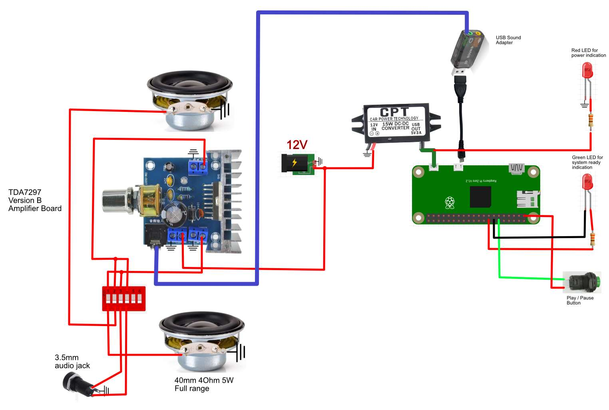

# Run Display
## Detect I2C device
```
sudo apt-get install i2c-tools
```

```
i2cdetect -y 1
```

```
     0  1  2  3  4  5  6  7  8  9  a  b  c  d  e  f
00:                         -- -- -- -- -- -- -- -- 
10: -- -- -- -- -- -- -- -- -- -- -- -- -- -- -- -- 
20: -- -- -- -- -- -- -- -- -- -- -- -- -- -- -- -- 
30: -- -- -- -- -- -- -- -- -- -- -- -- 3c -- -- -- 
40: -- -- -- -- -- -- -- -- -- -- -- -- -- -- -- -- 
50: -- -- -- -- -- -- -- -- -- -- -- -- -- -- -- -- 
60: -- -- -- -- -- -- -- -- -- -- -- -- -- -- -- -- 
70: -- -- -- -- -- -- -- --                        
```
## Python
```
pip3 install Pillow
pip3 install adafruit-circuitpython-ssd1306
```

Test code for display (OLED 0,96, 128x64, SSD1306, I2C, oled, blue/yellow). Something like this https://www.aliexpress.com/item/32896971385.html .
```python
import board
import busio
import adafruit_ssd1306
from PIL import Image, ImageDraw, ImageFont

WIDTH = 128
HEIGHT = 64
BORDER = 5

i2c = busio.I2C(board.SCL, board.SDA)
oled = adafruit_ssd1306.SSD1306_I2C(WIDTH, HEIGHT, i2c, addr=0x3c)

if __name__ == "__main__":
        oled.fill(0)
        oled.show()

        image = Image.new('1', (oled.width, oled.height))
        draw = ImageDraw.Draw(image)
        draw.rectangle((BORDER, BORDER, oled.width - BORDER - 1, oled.height - BORDER - 1), outline=255, fill=0)

        font = ImageFont.load_default()
        text = 'Hello Radio!'
        (font_width, font_height) = font.getsize(text)
        draw.text((oled.width//2 - font_width//2, oled.height//2 - font_height//2), text, font=font, fill=255)

        oled.image(image)
        oled.show()
```

## Final result (YT)
[](https://youtu.be/cFbxPmB2QRM)

# Components list
## Raspberry Zero W
https://www.raspberrypi.com/products/raspberry-pi-zero-w/

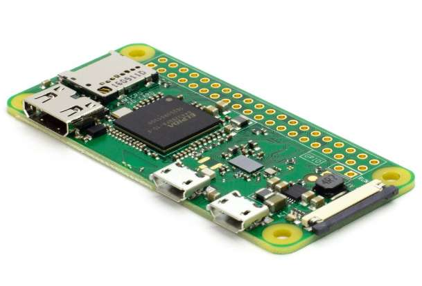

## Wooden Box
https://www.drevobox.cz/drevene-krabicky/drevena-krabicka-24x10-5x7-cm/

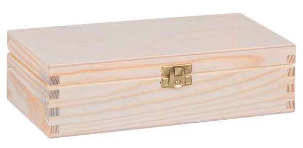

## Oled Display

https://www.aliexpress.com/item/32638662748.html (or similar)


## Speakers 5W 4Ohms 40mm
https://www.aliexpress.com/item/1005002662554047.html

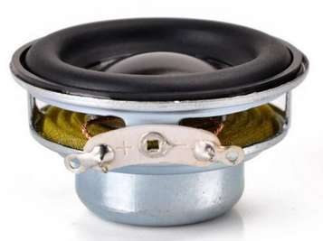

## Sound card
https://www.aliexpress.com/item/4000598865391.html

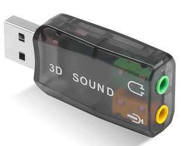

## Stereo amplifier 12V 2x10W D Class
https://www.aliexpress.com/item/1005001621840144.html

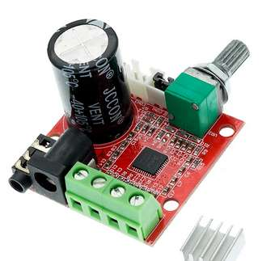

## DC converter 12V to 5V 3A
https://www.aliexpress.com/item/32960698360.html

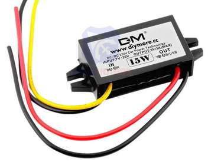

## LEDs 3-6V 6mm
https://www.aliexpress.com/item/1005003117140494.html

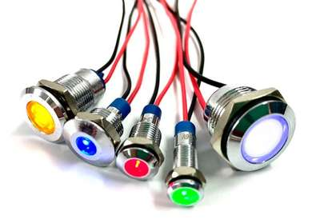

## Fan 30\*30\*10mm 5V
https://www.aliexpress.com/item/32407532684.html

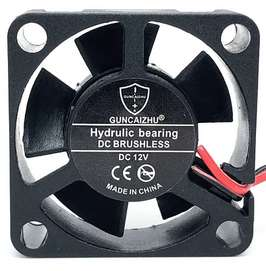

## DC Connector
https://www.aliexpress.com/item/1005003573403938.html


## 3.5MM Audio Jack Socket
https://www.aliexpress.com/item/32964979415.html


## DIP Switch 6P
https://www.aliexpress.com/item/4000159052465.html

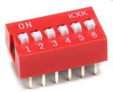

## Protective mesh
https://www.aliexpress.com/item/32890142735.html

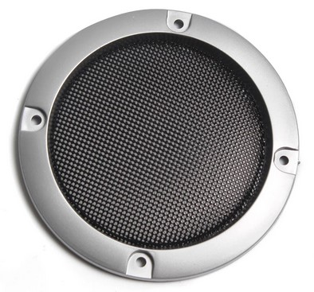

# Sources
Cause my memory is horrible and I did not use python for aeons.
## Logging
https://realpython.com/python-logging/
## RPi GPIO
https://raspberrypihq.com/use-a-push-button-with-raspberry-pi-gpio/

## RPi Zero GPIO pinout
https://pinout.xyz

## Python VLC
https://www.geeksforgeeks.org/vlc-module-in-python-an-introduction/

https://stackoverflow.com/a/66083570
## USB Audio Device
https://www.raspberrypi-spy.co.uk/2019/06/using-a-usb-audio-device-with-the-raspberry-pi/

## URLLIB
https://www.geeksforgeeks.org/python-urllib-module/

## URL Attachment
https://stackoverflow.com/a/61630166

## Script as a Service
https://gist.github.com/emxsys/a507f3cad928e66f6410e7ac28e2990f

## RPi multiple WiFi networks
https://ralfweinbrecher.de/post/multiple-wifi-networks-on-raspberrypi/

## python-vlc events
https://stackoverflow.com/a/36812273

https://github.com/oaubert/python-vlc/blob/master/generated/3.0/vlc.py

## I2C OLED display SSD1306
https://learn.adafruit.com/monochrome-oled-breakouts/python-wiring

## Python Imagigng Library
https://pillow.readthedocs.io/en/stable/index.html